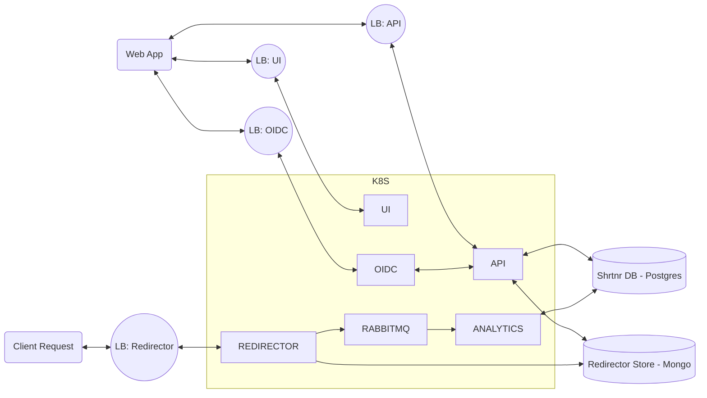

# Architectural Overview

### Services

- [shrtnr-api](services/shrtnr-api.md)
- [shrtnr-oidc](services/shrtnr-oidc.md)
- [shrtnr-analytics](services/shrtnr-analytics.md)
- [shrtnr-ui](services/shrtnr-ui.md)
- [shrtnr-redirector](services/shrtnr-redirector.md)

### System

- In short, the entire system will be deployed as a **Kubernetes** cluster (AKS), with load balancers for the public facing services.
- Our applications and services will be packaged as **Docker** images.
- In addition to the k8s system, we will have two data-stores.
    - [**MongoDB**](data-stores/shrtnr-redirector-store.md) backing the redirector as a horizontally scalable document store.
    - [**Postgres**](data-stores/shrtnr-db.md) backing the API and OIDC service as a relational store.
- Additional infrastructure includes a **RabbitMQ** instance for queueing up analytics data to be consumed by the analytics service.

### Diagram

