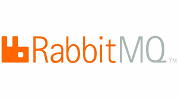
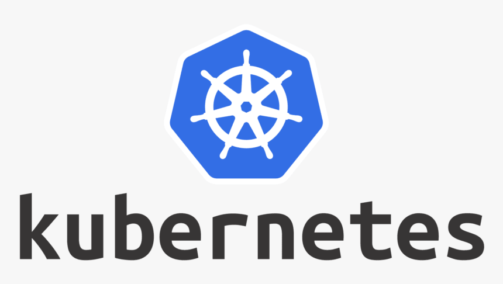
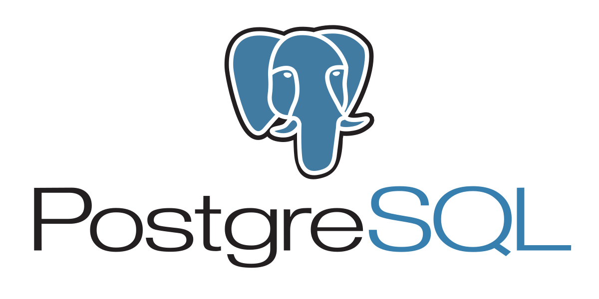
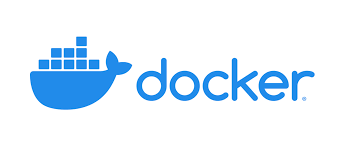

# Tech Stack

- [RabbitMQ](https://www.rabbitmq.com/documentation.html)

- [.Net](https://learn.microsoft.com/en-us/dotnet/)

- [NodeJS](https://nodejs.org/en/docs/)

- [Kubernetes](https://kubernetes.io/docs/home/)

- [Azure](https://learn.microsoft.com/en-us/azure/?product=popular)

- [MongoDB](https://www.mongodb.com/home)

- [Postgres](https://www.postgresql.org/docs/)

- [Open Id Connect](https://openid.net/connect/)

- [Docker](https://docs.docker.com/)

